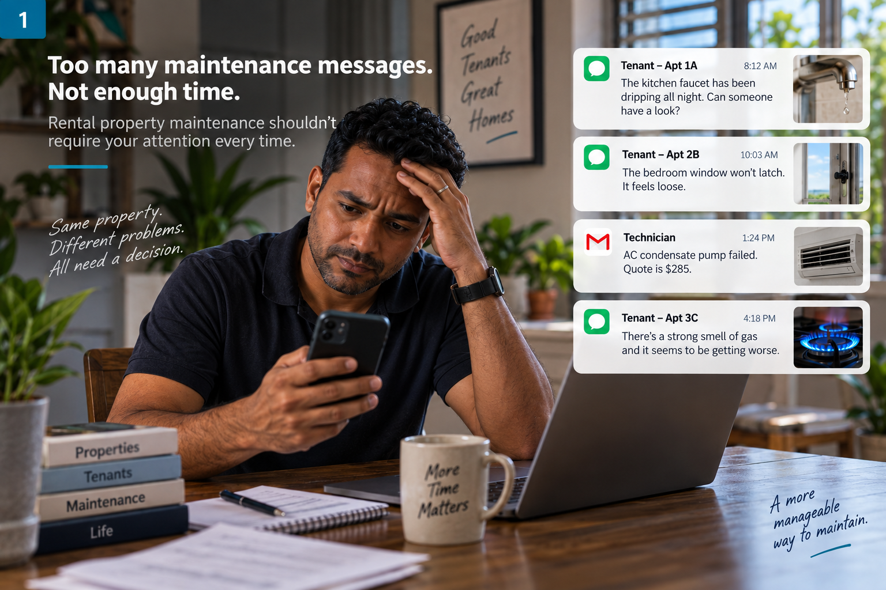
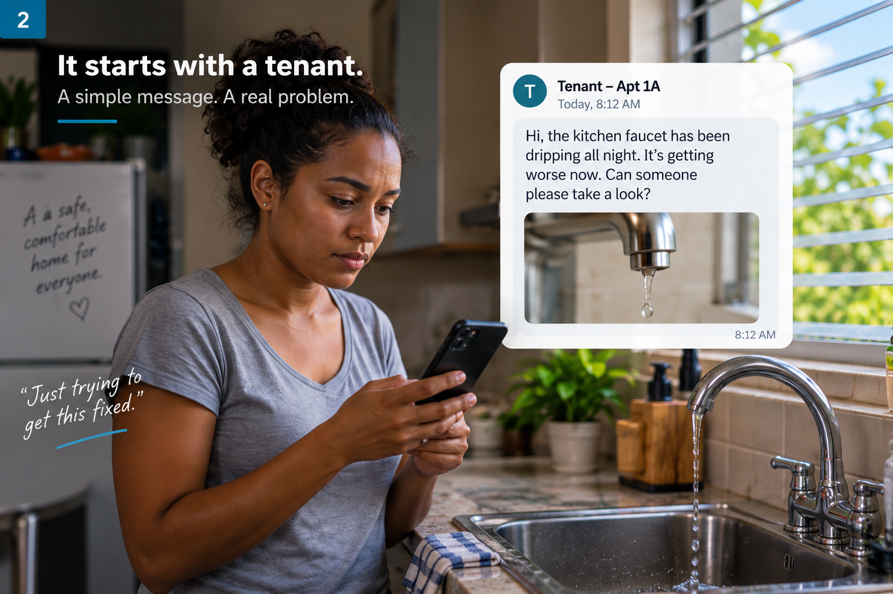
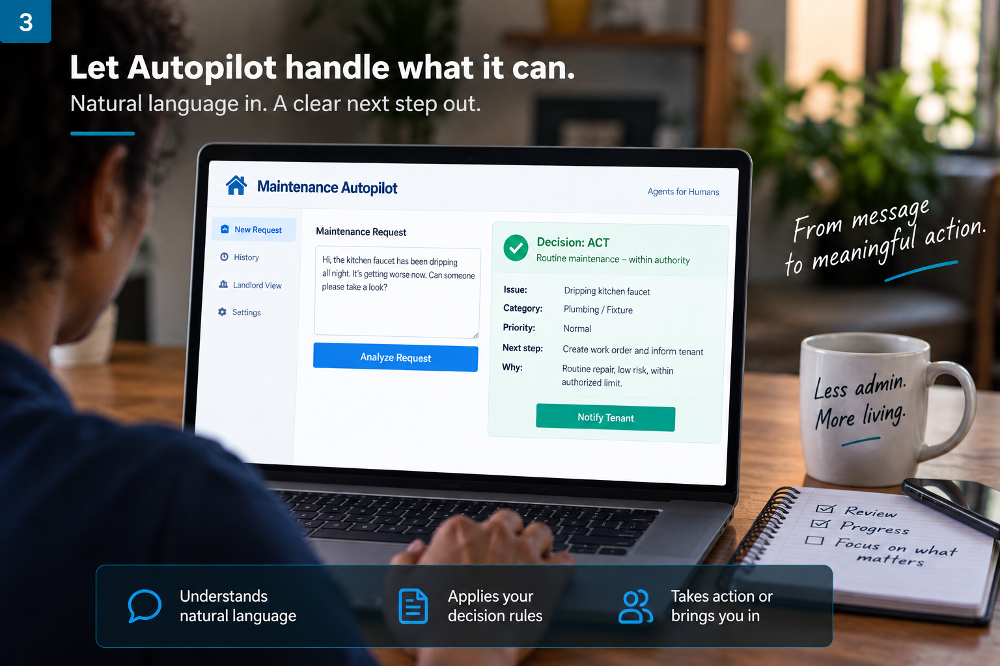
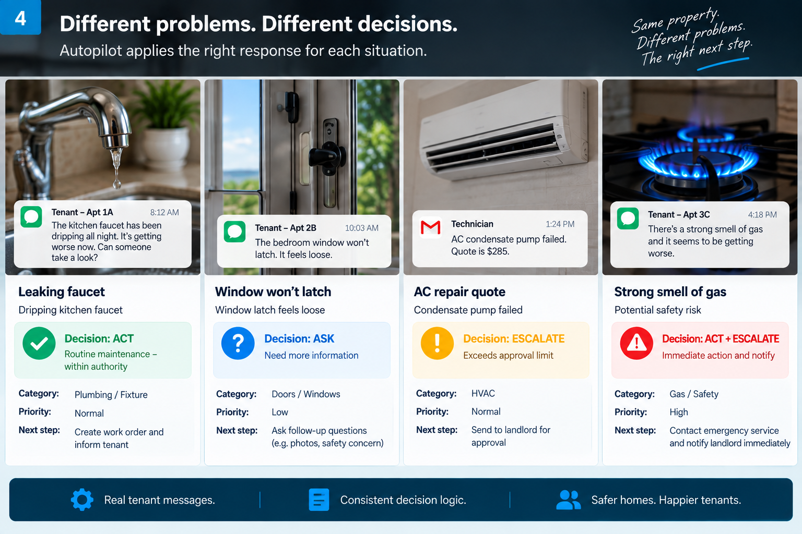
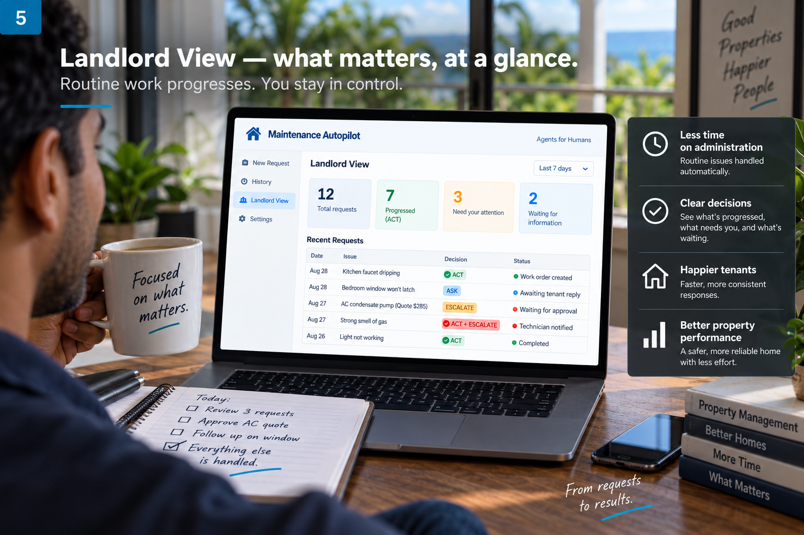
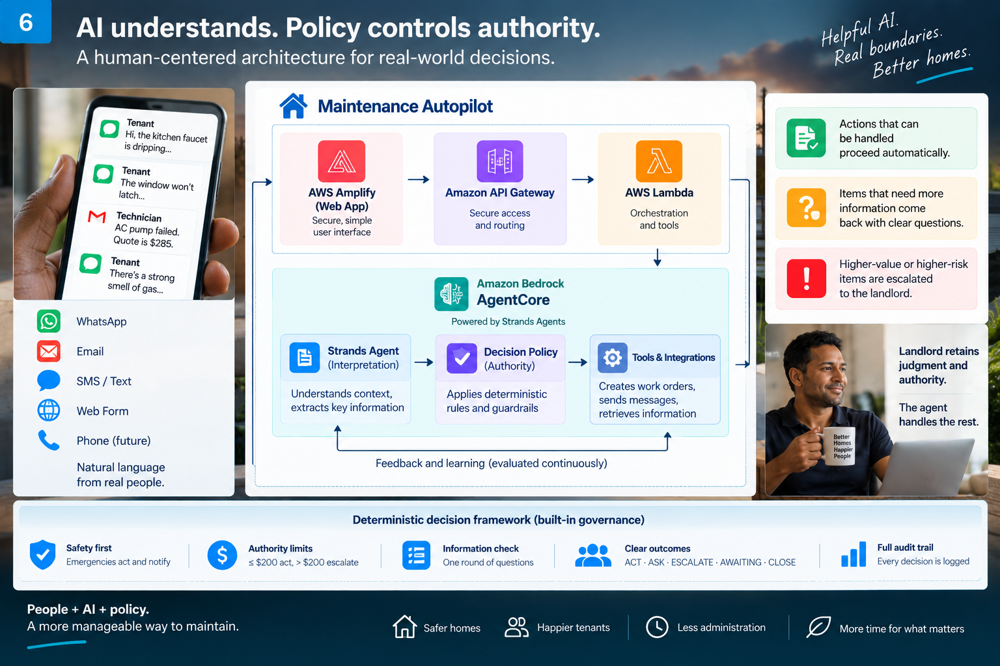
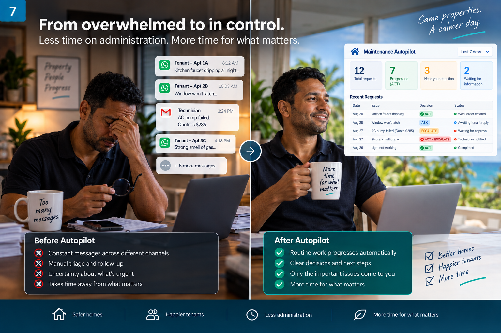
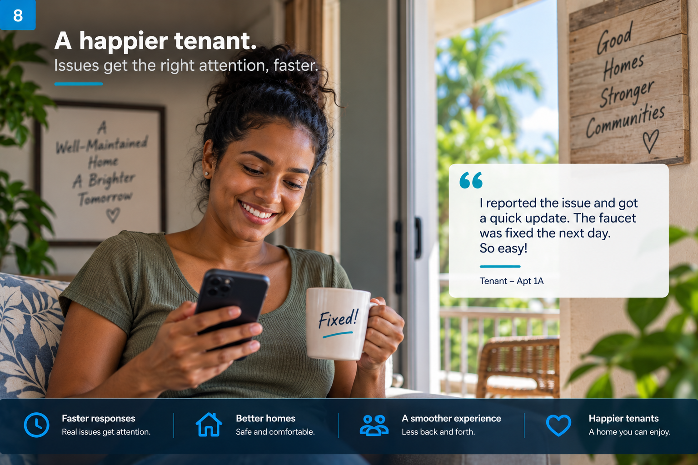

# Maintenance Autopilot

**A bounded-autonomy maintenance agent that knows when to act — and when not to.**

Maintenance Autopilot helps landlords keep routine maintenance moving while bringing them back in when their judgment, approval or attention is actually needed.

## 🚀 Try it live

### [Open Maintenance Autopilot](https://sproductiontaging.d5cp73uy4chyq.amplifyapp.com)

No login required.

Try one of the built-in maintenance examples or describe your own residential-maintenance issue in everyday language.

> **Use AI to understand what is happening. Use deterministic policy to control what must happen next.**

---

## Why Maintenance Autopilot?

Maintenance is full of small decisions.

A landlord might receive a dripping-faucet report, a bedroom window that will not latch, an AC repair quote, and a possible gas leak — all through the same channel.

Every message needs to go somewhere.

**But not every message needs the landlord.**



The goal of Maintenance Autopilot is not to automate everything.

It is to let routine work progress while returning risk, uncertainty and important decisions to the person who still owns the judgment.

---

## It starts with the tenant

Tenants should not need to learn a complicated maintenance system.

They should be able to describe what is wrong naturally.



Maintenance Autopilot interprets those unstructured reports and extracts the information needed to make a governed maintenance decision.

---

## Let Autopilot handle what it can

A maintenance report enters in ordinary language.

Autopilot determines:

- what the issue appears to be
- whether a safety concern exists
- whether enough information is available
- whether the work is within the configured authority
- whether the issue indicates recurrence or progression
- what governed action is allowed next



> The illustration above communicates the product experience. The current prototype returns governed workflow decisions; it does not yet dispatch contractors or send tenant notifications.

The deployed system supports six governed outcomes:

| Outcome | Meaning |
|---|---|
| **ACT** | Authorized to progress |
| **ASK** | More decision-changing information is needed |
| **AWAITING** | Waiting for external information or response |
| **ESCALATE** | Human approval or judgment is required |
| **ACT + ESCALATE** | Protective action is required while returning the issue to human attention |
| **CLOSE** | No further maintenance action is required |

---

## Different problems. Different decisions.

The same landlord may receive maintenance reports with completely different risk and authority implications.



For the current demo property, the configured repair-authority limit is **$200**.

That means, for example:

- a routine dripping faucet can progress
- an unclear window-security issue can request clarification
- a **$285 AC repair quote** returns to the landlord for approval
- a strong smell of gas takes the protective path

The objective is not simply to make a decision.

**It is to know the boundary of the decision the agent is allowed to make.**

---

## Giving the landlord back their attention

Individual decisions are only part of the maintenance problem.

The **Landlord View** brings them together into a simple operational picture:

**What came in? What progressed? What needs me? What are we waiting on?**



Routine maintenance can move without demanding attention every time, while issues that need judgment, approval or intervention are brought clearly to the surface.

---

# How it works

Maintenance Autopilot deliberately separates **semantic interpretation** from **decision authority**.



> The visual above illustrates the bounded-autonomy concept. The deployed technical architecture is shown below.

## Deployed AWS architecture


The live application follows this path:

**Browser → AWS Amplify → Amazon API Gateway → AWS Lambda → Amazon Bedrock AgentCore → Strands-based agent → Amazon Bedrock**

The semantic pipeline uses the **Strands Agents SDK** and **Amazon Bedrock** to interpret an unstructured report through:

**Issue decomposition → Hazard assessment → Case assessment → Repeat assessment → Validation**

The resulting structured concepts are passed to a **deterministic policy engine**.

The model does not freely choose the final workflow action.

Explicit policy rules control decision boundaries such as:

- critical hazards
- security exposure
- repair authority
- information sufficiency
- repeat failure
- replacement or upgrade decisions
- progressive damage
- property damage
- resolved issues

**AI interprets the situation. Policy controls the authority.**

---

## Bounded autonomy

Maintenance Autopilot V2.5 currently governs six possible outcomes:

`ACT` · `ASK` · `AWAITING` · `ESCALATE` · `ACT+ESCALATE` · `CLOSE`

Examples of deterministic boundaries include:

- critical hazard → **ACT+ESCALATE**
- repair cost above configured authority → **ESCALATE**
- unresolved security concern needing more information → **ASK**
- explicit no-response state → **AWAITING**
- repeat failure → **ESCALATE**
- resolved issue → **CLOSE**
- routine work within the boundary → **ACT**

This is the central design principle:

> **The best agent is not necessarily the one that does the most.**

A useful agent should also know when its autonomy should stop.

---

# Public application boundaries

The public demo includes controls around the deployed agent such as:

- server-controlled property context
- strict request validation
- input-size limits
- restrictive CORS
- API throttling
- bounded retry for transient AgentCore failures
- explicit timeout handling
- response-contract validation
- privacy-conscious logging
- least-privilege AgentCore invocation from the public Lambda
- browser double-submit protection

The interface also distinguishes between a **governed decision** and a **real-world event**.

For example, `ACT` means the work is **authorized to progress**.

It does not claim that a technician has been dispatched when no contractor integration exists.

---

# How I tested it

I used three separate evaluation layers.

They answer different questions and are intentionally **not combined into one accuracy number**.

## 1. Development evaluation

**111 / 111 governed outcomes correct**

These labelled cases were used during V2.5 development and regression testing.

They demonstrate correctness within the developed evaluation envelope and are **not presented as an unseen final holdout**.

---

## 2. Deployed hardening

Four representative decision scenarios were each run ten times against the deployed Amazon Bedrock AgentCore system.

**40 / 40 returned the expected governed outcome and policy rule.**

This tested whether the deployed system consistently preserved the intended governed decisions across repeated live evaluations.

---

## 3. Post-freeze Holdout C

The application was frozen before an additional **80-case holdout** was locked and officially evaluated.

The expected outcomes were preregistered and hashed before execution.

### Result

**63 / 80 — 78.8%**

Within that holdout:

- **ACT:** 17 / 18
- **ACT + ESCALATE:** 15 / 15
- **AWAITING:** 8 / 8
- **CLOSE:** 10 / 10
- **ASK:** 5 / 11
- **ESCALATE:** 8 / 18

Most importantly for the bounded-autonomy safety objective:

> **All 15/15 holdout cases preregistered as requiring protective ACT+ESCALATE behavior were correctly governed.**

The weaker areas were primarily clarification and non-critical escalation boundaries where the semantic interpretation layer first had to recognize repeat failure, progression or missing information.

Those misses were preserved.

There was **no post-result tuning, policy change or selective rerun** after the official evaluation.

---

## Reproducible evaluation trail

The repository preserves the evaluation sequence in Git:

### Frozen application

`b5d9f88`  
Tag: `submission-freeze-2026-09-06`

### Preregistered Holdout C

`71e92bb`  
Tag: `holdout-c-preregistered-2026-09-06`

### Official holdout results

`ae3b88c`  
Tag: `holdout-c-results-2026-09-06`

Ground-truth SHA-256:

`4626FC8DE92298F05F4F8C1B0CBE0921BB6BBB03CED5AA91172FA0CF486243B4`

Official predictions SHA-256:

`B3C06EA44E8096E591B11088A868411C85588AEA460D4E3320F796251E464DEF`

Relevant evidence files:

- `data/holdout_c_ground_truth.csv`
- `data/holdout_c_predictions_official.csv`
- `data/holdout_c_results.txt`

---

# From overwhelmed to in control

The technology matters because of what it can remove from the human workload.



For the landlord, the intended experience is:

**less manual triage → clearer decisions → routine work progressing → attention reserved for what matters**

The landlord retains authority.

The agent handles the decision space it has explicitly been given.

---

# And the tenant?

A maintenance workflow affects both sides of the relationship.



The longer-term opportunity is a maintenance experience where tenants can report problems naturally and landlords can respond more consistently without personally becoming the routing layer for every issue.

> The image above represents the intended future experience. The current prototype does not yet provide tenant messaging, contractor dispatch or completion tracking.

---

# What I learned

The first architecture was not the final one.

Early testing showed that simply placing a governor around an AI-generated decision was not enough.

That pushed V2.5 toward a clearer separation between:

**semantic interpretation**  
and  
**deterministic authority**

The post-freeze evaluation exposed another important lesson:

> A deterministic policy can enforce a boundary only when the semantic layer successfully surfaces the decision-critical fact that activates it.

That creates a clear next engineering problem: strengthen semantic recognition of repeat failure, progression and information sufficiency **without weakening the deterministic authority boundary**.

---

# What's next

A production version could extend the workflow toward:

**Tenant report → governed triage → approved work → contractor/work-order integration → completion → landlord oversight**

That would require:

- secure tenant and property identity
- durable workflow state
- contractor/work-order integrations
- notifications
- audit history
- production-grade monitoring
- broader real-world validation

The human goal would stay the same:

**Don't make the landlord manage every maintenance interaction. Bring them in when their judgment actually matters.**

---

# Repository guide

Key areas of the repository include:

```text
maintenance-autopilot/
├── MaintAutopilot/
│   └── agentcore/        # AgentCore application and V2.5 agent
├── data/                 # Evaluation datasets and preserved results
├── docs/
│   ├── architecture.png  # Deployed architecture diagram
│   └── media/            # Project story visuals
├── web/                  # Public browser interface
└── README.md